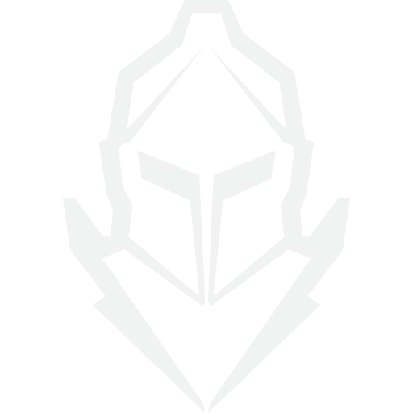

👋 Hey, I'm Régis
-------------

French 🇫🇷 Software Engineer, specializing in Blockchain technologies, thinking and building the world of tomorrow.

-------------

### ✨ About Me

I primarily develop in Python and use Solidity and TypeScript for web3 projects. I am driven by a passion for continuous learning and innovation, particularly in blockchain and web3 technologies. I thrive in collaborative environments, solving complex problems and creating cutting-edge solutions. I actively participate in web3 hackathons, explore new technologies, and contribute to open-source projects. I am keen on making a positive impact through my work, with a strong interest in privacy challenges in our increasingly connected world and interest in emerging technologies as Fully Homomorphic Encryption (FHE).

Feel free to explore my repositories and reach out if you’re interested in discussing technology trends, collaborative projects, or potential job opportunities. You can reach me direclty on [Linkedin](https://linkedin.com/in/regis-graptin/).

-------------

### 🏫 Education

- Engineer's degree (Master's level) - Computer Science - Data Science Specialization @ INSA Rennes - France (2018 - 2022)
- DUT - Computer Science @ IUT Montpellier - France (2016 - 2018)

-------------

### 📚 Certifications

- 2024 - [Uniswap Hook Incubator - Atrium Academy](https://opensea.io/assets/matic/0x130fa2dca456c2166c5505693dc1535040705dc2/67)
- 2023 - [Hugging Face - Deep Learning Reinforcement Learning Course](https://media.licdn.com/dms/image/D4E22AQGSGp2XPTOYrw/feedshare-shrink_800/0/1679758234495?e=1724284800&v=beta&t=pQYKcwpb9bVNLUy4_E34Vc307JO5zg1jQKXR-PHC9dg)
- 2023 - [Interchain Developer Academy](https://badgr.com/public/assertions/G5fClgwPTC62P6wD3K8hpQ)

-------------

### 💻 Hackathons

2025

- ETHDam III - [ZK-Pal](https://github.com/RegisGraptin/zk-pal)

- Scroll Open - [VaultFolio](https://github.com/RegisGraptin/VaultFolio)

- <picture></picture> 
Zama Bounty Program Season 7 - [Confidential Single-Price Auction](https://github.com/RegisGraptin/ConfidentialAuction)

- HackSecret 5 - [DocAssist](https://dorahacks.io/buidl/22966)

- Starknet Winter Hackathon - [Seth Lottery](https://app.buidlbox.io/projects/sethspin?path=projects%2Fsethspin)

2024

- Uniswap Hook Incubator - Cohort 3 - [Autopilot Hook](https://projects.atrium.academy/Autopilot-Hook-1555f0444abe817785f4dafc10e4db5d) 

- <picture><source media="(prefers-color-scheme: dark)" srcset="./images/eth_global_icon_black.svg"><source media="(prefers-color-scheme: light)" srcset="./images/eth_global_icon_white.png"></picture>
ETHGlobal Bangkok - [PourItOnChain](https://ethglobal.com/showcase/pouritonchain-u5f5x)

- HackSecret 4 - [Private Acknowledge Receipt on Chain](https://dorahacks.io/buidl/16855)

- ETH KL - [Stake & Run](https://devfolio.co/projects/start-and-run-8aed)

- Level Up Mini-Hack - [CipherScroll](https://github.com/RegisGraptin/CipherScroll)

- <picture><source media="(prefers-color-scheme: dark)" srcset="./images/eth_global_icon_black.svg"><source media="(prefers-color-scheme: light)" srcset="./images/eth_global_icon_white.png"></picture>
ETHGlobal Singapore - [Unify Finance](https://ethglobal.com/showcase/unify-finance-9dipd)

- <picture><source media="(prefers-color-scheme: dark)" srcset="./images/eth_global_icon_black.svg"><source media="(prefers-color-scheme: light)" srcset="./images/eth_global_icon_white.png"></picture>
Superhack 2024 - [Grant It](https://ethglobal.com/showcase/grant-it-h3sjo)

- <picture><source media="(prefers-color-scheme: dark)" srcset="./images/eth_global_icon_black.svg"><source media="(prefers-color-scheme: light)" srcset="./images/eth_global_icon_white.png"></picture>
ETHGlobal Brussels - [Meal Review](https://ethglobal.com/showcase/meal-review-1fry1)

- iBuild Online Hackathon - [RouteGuard](https://taikai.network/iExec/hackathons/ibuild/projects/clvhv2b9v059f3r01e0f0jfuu/idea)

- ETHDam - [B-Hook](https://taikai.network/cryptocanal/hackathons/ethdam2024/projects/clux971fz00nuvq01mh9g5phl/idea)

- ETH Oxford - [Health Book](https://taikai.network/home-dao/hackathons/ethoxford/projects/cltkcxi1404gdy5016nv6jtnh/idea)

-----------

2023

- <picture><source media="(prefers-color-scheme: dark)" srcset="./images/eth_global_icon_black.svg"><source media="(prefers-color-scheme: light)" srcset="./images/eth_global_icon_white.png"></picture>
ETHGlobal Istanbul - [Safety First](https://ethglobal.com/showcase/safety-first-98km1)

- ETHRome - [Quo-Roma](https://taikai.network/ethrome/hackathons/ethrome-23/projects/clnfs4sq800bzy90134ygt0rz/idea)

- <picture><source media="(prefers-color-scheme: dark)" srcset="./images/eth_global_icon_black.svg"><source media="(prefers-color-scheme: light)" srcset="./images/eth_global_icon_white.png"></picture>
ETHGlobal Paris - [Flora App](https://ethglobal.com/showcase/flora-app-nqkw0)

- ETH Brussels - [TOKENESTATE](https://taikai.network/ethbrussels/hackathons/ETHBrussels/projects/cliq6kjwm027uwn01a7nk2xr8/idea)

- ETH Porto - [Greenroom](https://taikai.network/ethporto/hackathons/ethportohackathon2023/projects/clfdpv1g640192101x27zcukt74/idea)

-------------

### 🌐 Online presence 

    &nbsp;&nbsp;&nbsp;
    &nbsp;&nbsp;&nbsp;
    &nbsp;&nbsp;&nbsp;
    &nbsp;&nbsp;&nbsp;

